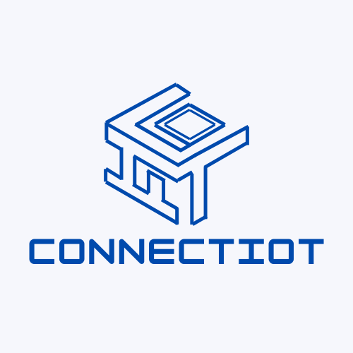
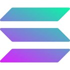
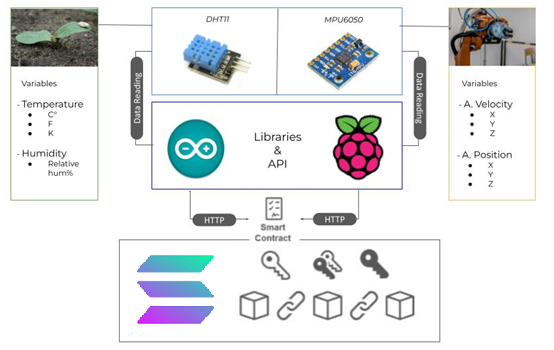

# Solana Supply Chain Mexbalia (SSCM)

  

<!-- 

  

 -->

## About this project
The development of ConnectIoT on Solana represents a significant leap 
forward in the integration o IoT and blockchain technologies, 
taking advantage of Solana’s scalability, speed, and low-cost transactions. 
This aligns with trends in supply chain innovation, such as AWS's use of 
IoT-enabled blockchain for traceability and transparency. 
Supply chains face increasing demand for real-time visibility, 
especially in high-stakes industries like pharmaceuticals, agriculture, 
and manufacturing. 
By leveraging blockchain’s immutability and IoT’s data collection 
capabilities, companies can track the provenance, status, and location of 
goods with unprecedented precision.

## Technologies

## Content

- [Solana Supply Chain Mexbalia (SSCM)](#solana-supply-chain-mexbalia-sscm)
  - [About this project](#about-this-project)
  - [Technologies](#technologies)
  - [Content](#content)
  - [What is ConnectIoT Solana SCM?](#what-is-connectiot-solana-scm)
  - [How does SSCM work?](#how-does-sscm-work)
  - [Architecture](#architecture)
  - [Credits](#credits)
  - [Contributions](#contributions)
  - [Licenses](#licenses)

## What is ConnectIoT Solana SCM?

ConnectIoT SSCM is an open-source platform with a smart contract for access services, which allows creating the connection between IoT devices and the Solana blockchain.

The main idea of ConnectIoT SSCM is to store and read, through the blockchain, valuable data from any IoT device that is connected and using the platform.

## How does SSCM work?
The SSCM project has four main parts for it to work entirely as a DApp.

- SSCM-Smart Contract
- SSCM-API
- SSCM-Libraries
- SSCM-Frontend

The smart contracts or programs are stored and running in the **Solana blockchain**, these contracts have a set of structures and functions that allow the user to **create registries, add devices within these registries, and also manage data and metadata belonging to the devices.** These functions or methods are reached through the API using the **Solana JavaScript SDK.** This API is be reached using Axios and, both python and Arduino libraries. 

This process can be understood more clearly with the architecture diagram.

## Architecture

  

---

## Credits
## Contributions

| [ Eban CM](https://github.com/EbanCM) | [ Mexbalia](https://github.com/MexbaliaMX) | [ Eduardo Campos](https://github.com/MexbaliaMX) |
| :-----------------------------------------------------------------------------------------------------------------------------------------------------------------------------: | :---------------------------------------------------------------------------------------------------------------------------------: | :--------------------------------------------------------------------------------------------------------------------------------------: |

## Licenses 

